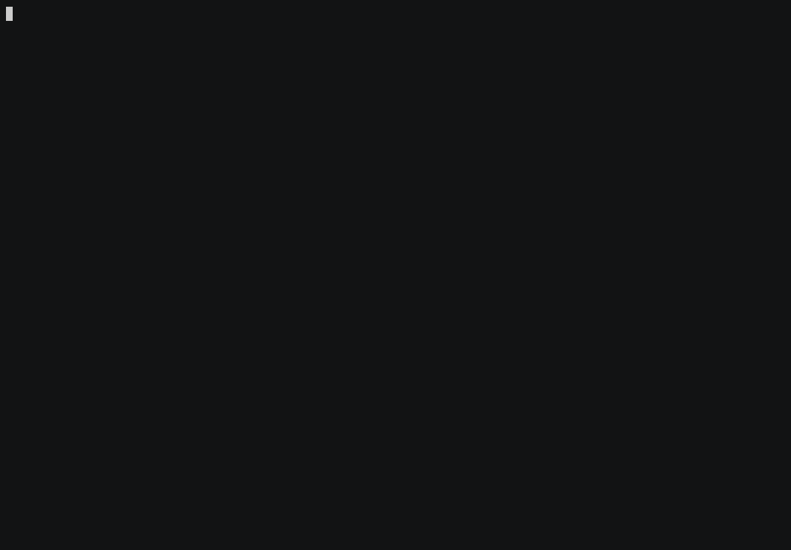
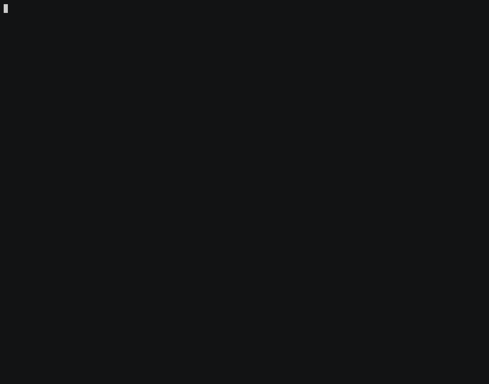
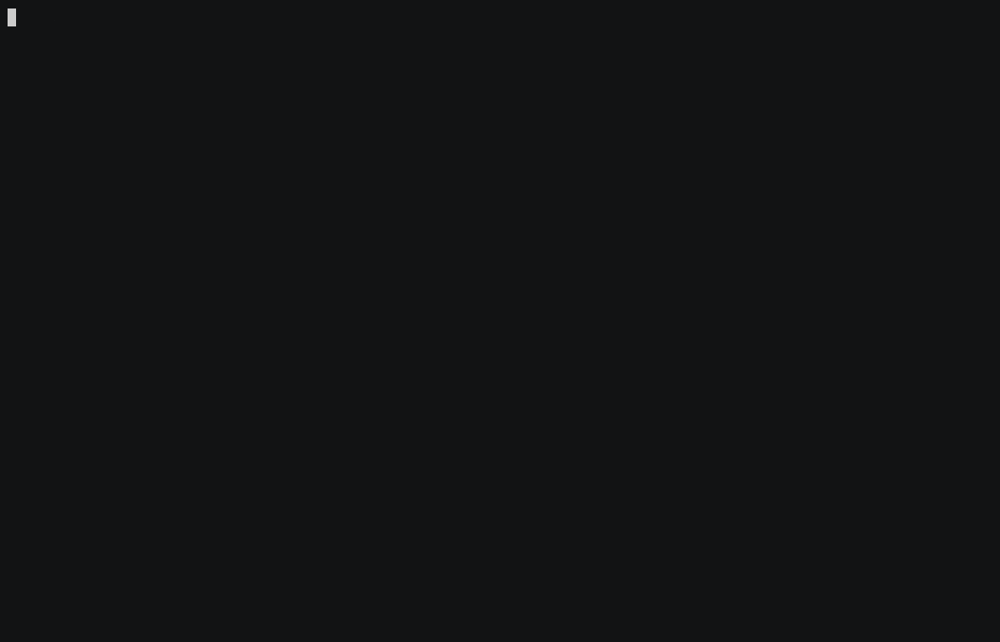
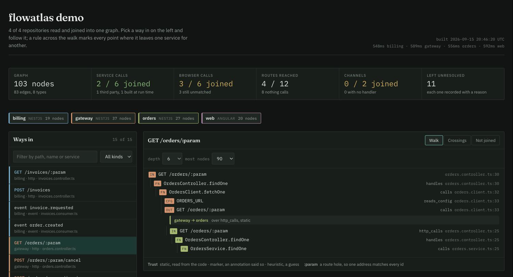

# Getting started

From nothing to a graph you can walk, in ten steps.

Everything below is a real recording of a real project. It is
[`fixtures/multi-repo`](../fixtures/multi-repo): four services that do not share
a repository — a gateway, an orders service and a billing service written with
NestJS, and an Angular frontend. Small enough to read in a sitting, and it
already has the problems a real project has: a call nobody can address, a route
one service asks for and another no longer serves, and two repositories that
disagree about a type.

This page is also a site, with the same recordings and a little more room:
<https://panevschi-ruslan.github.io/flowatlas/>. Every recording on either can be
made again with `scripts/demo/record.sh`.

---

## Before you start

Node 20 or newer, and two or more repositories of one project checked out beside
each other. That is the whole list.

```sh
npm install -g @flowatlas/cli
```

Or run it without installing:

```sh
npx @flowatlas/cli build
```

Nothing is executed from the repositories being read. flowatlas parses them and
closes the files.

---

## 1. Point it at the repositories

Put yourself in a directory with the repositories under it, or beside them, and
run `init`. It reads each manifest, works out the name and the kind, and writes
`flowatlas.config.json`. It also registers the graph server in every repository, so
an agent working in any one of them can ask about all of them.

```sh
flowatlas init            # find the repositories and ask about each one
flowatlas init --dir .    # look under this directory instead of beside it
```

`flowatlas link ../gateway ../orders ../web` is the same thing with the
repositories named rather than discovered. Either way, adding one later is one
more `link`.

> `flowatlas init` with no `--dir` scans the *parent* directory, which is what you
> want when the configuration lives inside one of the repositories, and not what
> you want when it lives above them. Pass `--dir .` for the second case.

## 2. Build

`build` reads every repository in its own process and joins the readings: a
request made in one service to the route that answers it in another, a message
published in one to whatever handles it, a button in a browser to the endpoint it
calls.


The summary is the part to read. A first build is rarely all green, and it is not
supposed to be:

```
calls out: 6 total, 1 linked, 1 by annotation, 0 no route, 4 unknown setting, 0 ambiguous, 1 third party, 0 dynamic
ui calls: 6 total, 1 joined to a route, 5 not (ambiguous-route-target 3, api-path-partly-read 1, target-route-not-found 1)
routes: 12 total, 2 reached, 10 never called, 1 claimed by two handlers
unresolved: 15
```

Four requests leave the gateway for an address flowatlas cannot attribute to any
service, and only one of six browser requests found its route. Nothing was
guessed; all of it was recorded.

## 3. Ask what it could not read

`doctor` is the command that turns those counts into a list of things to do.


Every row names the reason, the file, the line, the call, and what to do about
it. Here all four rows in the gateway say the same thing: a request is rooted at
a settings key, and no service in the configuration claims that key.

`doctor` has a section per kind of finding, and each can be asked for on its own:

```sh
flowatlas doctor --section unresolved    # what could not be read, grouped by reason
flowatlas doctor --section desync        # calls that no longer match a route
flowatlas doctor --section markers       # annotations that point at something gone
flowatlas doctor --section contracts     # what two services disagree about
flowatlas doctor --strict                # exit 1 if any of it is a problem
```

## 4. Answer it in the configuration

Two settings close four of the fifteen findings, and three of the five browser
requests that had nowhere to go.

**`baseUrlEnv`** is what turns a request into an edge. A service declares the
settings keys other services use to address it. Without it, a request is recorded
and joined to nothing.

**`apiTarget`** does the same for a browser: it says which service a frontend's
settings key points at.


The second build is the point of the exercise:

| | first build | after two settings |
|---|---|---|
| calls between services linked | 1 | 2 |
| browser requests joined to a route | 1 | 3 |
| routes something reaches | 2 | 4 |
| rows left unread | 15 | 11 |

What survives is no longer missing configuration. It is the project disagreeing
with itself, which is the thing worth knowing.

## 5. Follow one request

`flow` takes any way in and follows it until it stops.



The first trace starts at a `(click)` in an Angular template and ends at a row in
a table in a different repository, crossing two service boundaries on the way,
with `unresolved on this path: 0` to say nothing along it was guessed.

The second shows the other case. `BillingClient` builds its address at run time
from a registry, so nothing can be read from the source; an
[annotation](../README.md#when-reading-is-not-enough) on the method declares
where it goes, and the edge is recorded with `confidence: marker` rather than
`static`, so it is always clear which edges were told rather than found.

`config` then lists the settings that flow depends on, across every service it
touches, which is the answer to "what do I have to set for this to work at all".

An entry can be named however you would say it aloud. These three are the same
route:

```sh
flowatlas flow "POST /orders/12345"
flowatlas flow "POST /orders/:param"
flowatlas flow "entry:orders:http:POST:/orders/:param"
```

## 6. Ask the other direction

`impact` starts at a symbol and walks backwards to every way in that reaches it.



Give it a table and it tells you which routes would have to be retested. Give it
a method and it tells you which of them are in other people's services.
`hotspots` ranks what the most things point at, and `channel` shows both ends of
a message channel — here, one with a handler and no publisher anywhere in the
project.

## 7. Compare what crosses a boundary

Two services agree about a shape until one of them changes. `contracts` compares
what each side of every crossing declares, field by field.



The frontend declares an `OrderDto` with four required fields, and the gateway
answers that route with none of them: it sends a wrapper whose only field is
`data`, of an unreadable shape. Nobody wrote that down anywhere and no test
covers it, because the two sides live in different repositories.

The `unchecked` list matters as much as the findings. It says which boundaries
could not be compared and what to do about each, rather than reporting them as
agreement.

`types --drift` is the cheaper question: which names are declared two ways in two
repositories.

## 8. See the shape of the whole thing


```sh
flowatlas stats --format tree   # what the graph is made of
flowatlas dead                  # entries, channels and providers nothing reaches
flowatlas cycles                # circular dependencies, cross-service first
flowatlas visualise             # the whole graph as one self-contained page
```

`dead` is the one to read carefully. It says so itself: nothing in it is proof,
every row is a heuristic with the reason it fired attached.

`visualise` writes one page with the graph inside it: no server and nothing to
install. It asks Google Fonts for two typefaces and falls back to yours if it
cannot reach them, so it reads offline but is not yet free of a third party. It opens on the reconciliation, lists every way in, and follows any
one of them across service boundaries, marking each crossing with what it was
joined by and how much to trust it.



It is a report you can click, not a viewer you keep running. Attach it to a
review, or keep it beside a decision.

## 9. Ask what a branch changes

`diff` builds the graph at two revisions and reports what moved between them.


One route is renamed in the orders service. flowatlas names the gateway route that
called it and the browser button above that, in two repositories the change does
not touch. The output is markdown because its destination is a pull request
comment; `--fail-on-contract-break` makes it a build failure instead. See
[docs/ci.md](ci.md) for the whole recipe.

## 10. Give it to an agent

`init` already registered the server in each repository. An agent in any one of
them gets the whole project.


Ten tools, and only one of them returns source code. A trace never drags in the
body of every method along it; the agent asks the graph which name to look at,
then asks for that one name.

```sh
flowatlas mcp --install       # register in every repository, merging what is there
flowatlas mcp --install --dry-run
```

After that, `claude mcp list` shows `flowatlas`.

---

## Where to go next

- [The graph server](mcp.md) — setup for Claude Code, Cursor, VS Code and Claude
  Desktop, what each of the ten tools takes, and the order to call them in.
- [The command reference](CLI.md) — every command, every flag, every
  configuration key.
- [Running it in CI](ci.md) — the staged adoption that does not fail the build on
  day one.
- [The README](../README.md) — how the joining works, and what it still cannot
  read.

## Reproducing these recordings

```sh
scripts/demo/record.sh          # all of them, into docs/media
scripts/demo/record.sh 04 09    # just those two
```

Each scene is a shell script under `scripts/demo/scenes`. The commands you see
typed are the commands that ran; the driver sizes the terminal to the scene and
renders it with [asciinema](https://asciinema.org) and
[agg](https://github.com/asciinema/agg).

```sh
brew install asciinema agg
```
