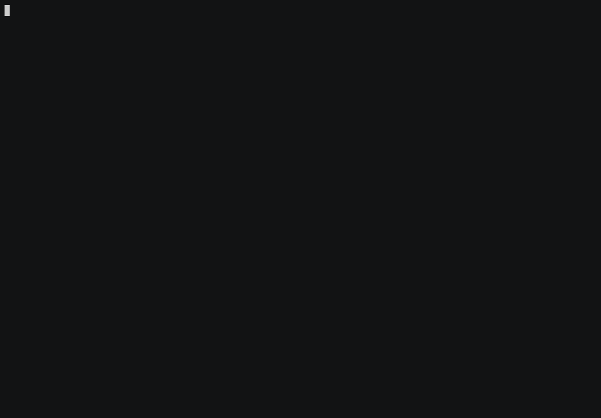
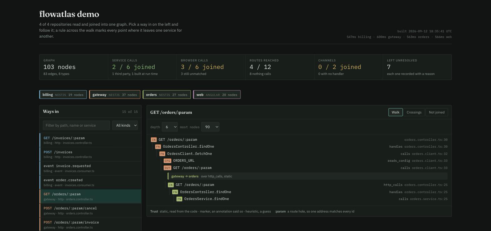

# Getting started

From nothing to a graph you can walk, and the first four questions worth asking
of it.

Everything below can be run. The examples use the fixtures in this repository —
small projects under `fixtures/`, each with a README saying what it exists to
prove — so you can try every step before pointing the tool at your own code.
The main one is [`fixtures/multi-repo`](../fixtures/multi-repo): four services
that do not share a repository, a gateway, an orders service and a billing
service written with NestJS, and an Angular frontend. It is small enough to read
in a sitting, and it already has the problems a real project has: a call nobody
can address, a route one service asks for and another no longer serves, and two
repositories that disagree about a type.

The recordings on this page are of that fixture, and the same walkthrough is a
site at <https://panevschi-ruslan.github.io/flowatlas/>. Every recording can be
made again with `scripts/demo/record.sh`.

---

## 1. Install

Node 20 or newer, and the repositories of one project checked out beside each
other. That is the whole list.

```sh
npm install -g @flowatlas/cli
```

Or run it without installing anything:

```sh
npx @flowatlas/cli build
```

To run the examples on this page, use a checkout of this repository instead,
because the fixtures are in it:

```sh
git clone https://github.com/Panevschi-Ruslan/flowatlas.git
cd flowatlas
pnpm install
pnpm -r build
pnpm flowatlas --help          # the same command as `flowatlas`
```

Nothing is executed from the repositories being read. flowatlas parses them with
the TypeScript checker and closes the files.

**Install each repository's dependencies if you can.** The checker follows a
type into a package only when the package is on disk. A repository read without
them is still read — the source says a great deal on its own, and what is read
that way is marked `heuristic` — but a run over one opens with a sentence saying
the read was partial, and means it.

---

## 2. Point it at the repositories: `init`

Put yourself in a directory with the repositories under it, or beside them, and
run `init`. It reads each manifest, works out a name and a type for each
repository, and writes `flowatlas.config.json`. It also registers the graph
server in every repository, so an agent working in any one of them can ask about
all of them.

```sh
flowatlas init            # look beside the directory you are in
flowatlas init --dir .    # look under this directory instead
```

> `init` with no `--dir` scans the *parent* directory, which is what you want
> when the configuration lives inside one of the repositories. Pass `--dir .`
> when it lives above them. It looks one level down, at each directory with a
> `package.json`.

Over a copy of `fixtures/multi-repo`, with its configuration deleted, it
proposes this:

```
$ flowatlas init --dir . --yes
Wrote …/flowatlas.config.json with 4 service(s):
  billing  ./billing  nestjs
  gateway  ./gateway  nestjs
  orders  ./orders  nestjs
  web  ./web  angular
```

Without `--yes` it asks about each one. The type is what decides which reader
opens a repository, and it is read from the manifest: a server type wins over a
browser type when a repository declares both, because the server reader reads
the browser half too. A framework nothing here reads — Nuxt, Remix, Vue,
Svelte — is named rather than silently skipped.

**A monorepo is proposed as its applications.** A repository that declares a
workspace, in `workspaces` or a `pnpm-workspace.yaml`, becomes one service per
member that looks like an application, and none for the packages those
applications import, because a package is read as part of whichever service
declares it. Run from the directory holding a copy of
[`fixtures/next-monorepo`](../fixtures/next-monorepo), whose Next.js application
is in `apps/web` and whose handler bodies are in `packages/orders-lib`:

```
Wrote …/flowatlas.config.json with 1 service(s):
  web  ./next-monorepo/apps/web  nextjs
```

Point `init` at the directory the monorepo sits in, not at its root: it looks one
level down, and from inside a root whose members are two levels down, as
`apps/web` is, it finds nothing.

One service, and one graph that runs from its route into the package:

```
◆  GET /api/orders              web/app/api/orders/route.ts:7
  →  GET                        web/app/api/orders/route.ts:7
    →  listOrders               web/../../packages/orders-lib/src/index.ts:11
      →  readOrders             web/../../packages/orders-lib/src/store.ts:13
        ⚙  ORDERS_UPSTREAM_URL  web/../../packages/orders-lib/src/store.ts:14
        ↗  GET /orders          web/../../packages/orders-lib/src/store.ts:16
        ↗  GET /orders          web/../../packages/orders-lib/src/store.ts:16
unresolved on this path: 2
```

The request is there twice because one `fetch` is read by both halves of a
repository that is a server and a browser at once, and the two rows are true: the
far side is not in this configuration, and nothing declares
`ORDERS_UPSTREAM_URL`.

`flowatlas link ../gateway ../orders ../web` is the same thing with the
repositories named rather than discovered, for when they are not all in one
place. Adding one later is one more `link`.

## 3. Read and join them: `build`

`build` reads every repository in its own process and joins the readings: a
request made in one service to the route that answers it in another, a message
published in one to whatever handles it, a button in a browser to the endpoint
it calls.

```sh
pnpm flowatlas build --config fixtures/multi-repo/flowatlas.config.json
```


The summary is the part to read (each service's line also says how long it
took, left out here):

```
built 125 nodes, 108 edges from 4 service(s)
  billing        19 nodes, 0 unresolved
  gateway        43 nodes, 1 unresolved
  orders         32 nodes, 1 unresolved
  web            32 nodes, 3 unresolved
calls out: 6 total, 2 linked, 1 by annotation, 1 no route, 1 unknown setting, 0 ambiguous, 1 third party, 1 dynamic
ui calls: 13 total, 6 joined to a route, 7 not (ambiguous-route-target 1, api-path-dynamic 3, api-path-partly-read 1, target-route-not-found 2)
channels: 3 total, 1 joined, 1 with no handler, 1 with no publisher
routes: 15 total, 7 reached, 8 never called, 1 claimed by two handlers
ways in: 17 found, 17 with a handler that was read, 0 without — only the second number is coverage of what happens after the request arrives
types: 14 (4 from shared packages)
unresolved: 14
```

A first build is rarely all joined, and it is not supposed to be. Nothing was
guessed: every request that did not join is counted by the reason it did not.
Three lines are worth knowing about before they surprise you:

- **`ways in`** counts entry points found apart from entry points whose handler
  was read. Only the second is coverage of what happens after a request arrives.
- **`… contributed no node`** names a service a reader opened and put nothing into
  the graph from, usually because its `type` names a reader for a framework it
  does not use.
- **`… found at arm's length`** names a framework a service has only through a
  workspace package it declares, so you can judge whether that package's code
  really runs there.

`build` writes three files under `.flowatlas`: `project-graph.json`, the graph
itself; `link-report.json`, what joined and why not; and `graph.db`, the same
graph as SQLite, which every question below reads. A second build of unchanged
sources reads nothing again, and `build --watch` keeps the project open and
rebuilds on every save.

## 4. Ask what it could not read: `doctor`

`doctor` turns those counts into a list of things to do, grouped by reason, with
the file, the line and what to change.

```sh
pnpm flowatlas doctor --config fixtures/multi-repo/flowatlas.config.json
```


The first line is the verdict:

```
unresolved: total=12 (missing) · markers: errors=0 warnings=0 · desync=5 · contracts: errors=0 ignored=0 · exit=0
```

`total=12` is the rows somebody could act on. The places static reading cannot
see at all are counted beside them and never added in, and neither are the
places where nothing joins because there is nothing to join. `(missing)` says
there is no baseline yet; `flowatlas doctor --accept` writes one, to commit like
a lockfile, and from then on `--strict` fails only on growth.

`doctor` has a section per kind of finding, and each can be asked for on its own:

```sh
flowatlas doctor --section unresolved    # what could not be read, grouped by reason
flowatlas doctor --section desync        # calls that no longer match a route
flowatlas doctor --section markers       # annotations that point at something gone
flowatlas doctor --section contracts     # what two services disagree about
flowatlas doctor --strict                # exit 1 if any of it is a problem
```

**Exit 2 means the graph is not one to report on.** Four graphs are refused
whatever flags were given: one a failed build wrote, one with no node in it, one
a service contributed nothing to, and one where most of a service's ways in were
read as far as their addresses and no further. In each of those every check would
answer "nothing wrong" about code nobody read.
[`fixtures/next-hollow`](../fixtures/next-hollow) is both of the last two at once:

```sh
pnpm flowatlas build  --config fixtures/next-hollow/flowatlas.config.json
pnpm flowatlas doctor --config fixtures/next-hollow/flowatlas.config.json --no-baseline
# unresolved: total=6 (skipped) · … · exit=2
```

## 5. Answer it in the configuration

Most of what a first build cannot join is a fact only the person who deployed
the project knows. Two settings do most of the work.

**`baseUrlEnv`** is what turns a request into an edge. A service declares the
settings keys other services use to address it. Without it, a request is recorded
and joined to nothing.

**`apiTarget`** does the same for a browser: it says which service a frontend's
settings key points at.


What survives a configured build is no longer missing configuration. It is the
project disagreeing with itself, which is the thing worth knowing.

## 6. The first four questions

### Follow one request: `flow`

`flow` takes any way in and follows it until it stops.

```sh
pnpm flowatlas flow "POST /orders" --config fixtures/multi-repo/flowatlas.config.json
```

```
◆  POST /orders                                        orders/src/orders/orders.controller.ts:31
  →  OrdersController.create                           orders/src/orders/orders.controller.ts:31
    →  OrdersService.create                            orders/src/orders/orders.service.ts:40
      ▣  write Order                                   orders/src/orders/orders.service.ts:41
        ▤  Order
      ⚡ event order.created                            orders/src/orders/orders.service.ts:49
        ⚡ order.created                                src/orders/orders.service.ts:49
          ⇢ billing ⚡ InvoicesConsumer.onOrderCreated  billing/src/invoices/invoices.consumer.ts:17
            →  InvoicesConsumer.onOrderCreated         billing/src/invoices/invoices.consumer.ts:17
              →  InvoicesService.create                billing/src/invoices/invoices.service.ts:10
unresolved on this path: 0
```

One route, the row it writes, the event it publishes, and the handler in another
repository that receives it, marked `⇢ billing` where the walk crosses into it.
`unresolved on this path: 0` says nothing along it was guessed. `--ascii` prints
plain prefixes instead of the icons.



An entry can be named however you would say it aloud. These three are the same
route:

```sh
flowatlas flow "POST /orders/12345"
flowatlas flow "POST /orders/:param"
flowatlas flow "entry:orders:http:POST:/orders/:param"
```

A tRPC procedure is named by its id, `entry:api:rpc:orders.list`, and a name that
matches two applications or two services comes back as a choice rather than a
guess. `flowatlas config <entry>` lists every setting a flow depends on, across
every service it touches, which is the answer to "what do I have to set for this
to work at all".

### Ask the other direction: `impact`

`impact` starts at a symbol and walks backwards to every way in that reaches it:
the answer to "what would have to be retested".

```sh
pnpm flowatlas impact OrdersService.create --entries-only --config fixtures/multi-repo/flowatlas.config.json
```

```
→  OrdersService.create  orders/src/orders/orders.service.ts:40
  ◆  POST /orders        orders/src/orders/orders.controller.ts:31
Reachable from: 1 http entry (orders)
```

Give it a table and it names the routes that write it. Give it a method and it
names the ones in other people's services.


### Look for what nothing reaches: `dead`

```sh
pnpm flowatlas dead --kind entries --config fixtures/multi-repo/flowatlas.config.json
```

```
nothing here is proof: every row is a heuristic with the reason it fired
…
entries:
  id                                       where                                 why
  entry:billing:event:invoice.requested    src/invoices/invoices.consumer.ts:28  channel:invoice.requested has no publisher in any repo
  entry:billing:http:GET:/invoices/:param  src/invoices/invoices.controller.ts:26  no http_calls/hits from any repo (may be a public API)
  …
```

It says so itself: nothing in it is proof. Every row carries the reason it is
there, and a route that is public by decision, a health probe or an event stream
says which, so the rows nothing explains come first.

### See both ends of a message: `channel`

```sh
pnpm flowatlas channel order.created --config fixtures/multi-repo/flowatlas.config.json
```

```
⚡ order.created                           src/orders/orders.service.ts:49
  ·  producers (1)
    ⚡ event order.created                 orders/src/orders/orders.service.ts:49
  ·  consumers (1)
    ⚡ InvoicesConsumer.onOrderCreated     billing/src/invoices/invoices.consumer.ts:17
      →  InvoicesConsumer.onOrderCreated  billing/src/invoices/invoices.consumer.ts:17
        →  InvoicesService.create         billing/src/invoices/invoices.service.ts:10
```

A channel with nothing at one end comes back with an empty list, which is an
answer rather than an error.

---

## 7. Try it on the other shapes

Each of these is one command from a checkout, and each fixture's README says what
to look for.

| Fixture | What it shows |
|---|---|
| [`trpc-join`](../fixtures/trpc-join) | procedures on the server, and `trpc.orders.list.useQuery(…)` in a browser joined to them by path |
| [`next-caller-application`](../fixtures/next-caller-application) | one service holding three Next.js applications, and a request reaching its own application's route |
| [`nest-two-applications`](../fixtures/nest-two-applications) | an API and a worker in one repository, each serving `GET /health` |
| [`socket-namespaces`](../fixtures/socket-namespaces) | socket.io read from both ends, with the namespace opened by `io.of(…)` |
| [`object-channels`](../fixtures/object-channels) | an in-house job bus described in configuration alone |
| [`multi-repo-asyncapi`](../fixtures/multi-repo-asyncapi) | a service you do not have the source of, declared by an AsyncAPI document |
| [`nest-mount-empty`](../fixtures/nest-mount-empty) | a route behind a mount every environment file leaves empty, joined and marked as a guess |
| [`express-not-installed`](../fixtures/express-not-installed) | an Express service with no `node_modules`, read from what its source states |
| [`koa-react-full-stack`](../fixtures/koa-react-full-stack) | one directory that is a server and a browser, read by the reader that reads both |

A fixture with a `flowatlas.config.json` is a project:

```sh
pnpm flowatlas build --config fixtures/trpc-join/flowatlas.config.json
```

and one with only a `package.json` is a single repository, read without joining:

```sh
pnpm flowatlas extract fixtures/express-not-installed --out /tmp/express-not-installed
```

---

## 8. Compare what crosses a boundary

Two services agree about a shape until one of them changes. `contracts` compares
what each side of every crossing declares, field by field.


The `unchecked` list matters as much as the findings. It says which boundaries
could not be compared and why, rather than reporting them as agreement.
`types --drift` is the cheaper question: which names are declared two ways in two
repositories.

## 9. See the shape of the whole thing


```sh
flowatlas stats --format tree   # what the graph is made of
flowatlas cycles                # circular dependencies, cross-service first
flowatlas hotspots              # what the most things point at
flowatlas visualise             # the whole graph as one self-contained page
```

`visualise` writes one page with the graph inside it: no server and nothing to
install. It asks Google Fonts for two typefaces and falls back to yours if it
cannot reach them, so it reads offline but is not yet free of a third party. It
opens on the reconciliation, lists every way in, and follows any one of them
across service boundaries, marking each crossing with what it was joined by and
how much to trust it.



## 10. Ask what a branch changes

`diff` builds the graph at two revisions and reports what moved between them.


One route is renamed in the orders service, and flowatlas names the gateway route
that called it and the browser button above that, in two repositories the change
does not touch. The output is markdown because its destination is a pull request
comment; `--fail-on-contract-break` makes it a build failure instead. See
[docs/ci.md](ci.md) for the whole recipe.

## 11. Give it to an agent

`init` already registered the server in each repository. An agent in any one of
them gets the whole project.


Ten tools, and only one of them returns source code. A trace never drags in the
body of every method along it; the agent asks the graph which name to look at,
then asks for that one name.

```sh
flowatlas mcp --install       # register in every repository, merging what is there
flowatlas mcp --install --dry-run
```

After that, `claude mcp list` shows `flowatlas`.

---

## Where to go next

- [The graph server](mcp.md) — setup for Claude Code, Cursor, VS Code and Claude
  Desktop, what each of the ten tools takes, and the order to call them in.
- [The command reference](CLI.md) — every command, every flag, every
  configuration key, and every reason a row can carry.
- [Running it in CI](ci.md) — the staged adoption that does not fail the build on
  day one.
- [The README](../README.md) — how the joining works, what it reads, and what it
  still cannot.

## Reproducing these recordings

```sh
scripts/demo/record.sh          # all of them, into docs/media
scripts/demo/record.sh 04 09    # just those two
```

Most scenes run against `fixtures/multi-repo`; the stream one runs against
`fixtures/sse-stream`, and the folded-channel one against
`fixtures/folded-channels`.

Each scene is a shell script under `scripts/demo/scenes`. The commands you see
typed are the commands that ran; the driver sizes the terminal to the scene and
renders it with [asciinema](https://asciinema.org) and
[agg](https://github.com/asciinema/agg).

```sh
brew install asciinema agg
```
